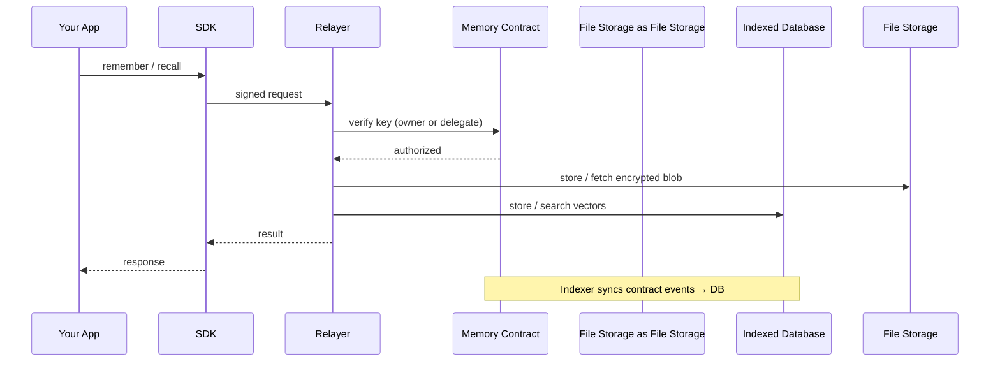

Memory is made up of six core components that work together to give your app encrypted, owner-controlled memory.



## SDK

The TypeScript SDK is the main entry point for developers. It wraps all Memory operations into a simple client that your app calls directly.

**Responsibilities:**
- Signs every request with the configured key
- Sends requests to the relayer
- Exposes `remember`, `recall`, `analyze`, `ask`, and `restore` methods

```ts
const memory = Memory.create({
  key: process.env.MEMORY_PRIVATE_KEY!,
  accountId: process.env.MEMORY_ACCOUNT_ID!,
  serverUrl: process.env.MEMORY_SERVER_URL,
  namespace: "my-app",
});

await memory.remember("User prefers dark mode.");
```

## Relayer

The relayer is the backend service that processes all SDK requests. It abstracts all Web3 complexity behind a familiar REST API — developers interact with Memory using standard HTTP calls, while the relayer handles blockchain transactions, encryption, and decentralized storage behind the scenes.

This means Web2 developers can integrate Memory without touching wallets, signing transactions, or understanding MySo directly. The relayer can also sponsor transaction fees and storage costs on behalf of users, removing onchain friction entirely.

**Responsibilities:**
- Exposes a Web2-friendly REST API for all memory operations
- Verifies key authorization against the smart contract
- Generates embeddings for memory content
- Encrypts and decrypts memory payloads
- Uploads and downloads blobs to/from File Storage
- Stores and searches vector metadata in the indexed database
- Scopes all operations to `owner + namespace` (with MYDATA encryption bound to the app's package ID)
- Can sponsor transaction and storage fees for user requests

<Note>
Because the relayer handles encryption and plaintext data, you are placing trust in the relayer operator. This is a deliberate trade-off for developer experience. If you need full control over that trust boundary, you can [self-host](/relayer/self-hosting) your own relayer, or use the [manual client flow](/sdk/usage) to handle encryption and embedding entirely on the client side (recommended for Web3-native users). See [Trust & Security Model](/fundamentals/architecture/data-flow-security-model) for details.
</Note>

You can use the [managed relayer](/relayer/public-relayer) to get started, [self-host](/relayer/self-hosting) your own, or use the manual client flow for full client-side control.

## Memory Smart Contract

The MySo smart contract is the source of truth for ownership and access control.

**Responsibilities:**
- Defines who owns a Memory account
- Stores which delegate keys are authorized
- Enforces access rules on every request (verified by the relayer)
- Emits events when accounts or delegates change

The contract doesn't store memory content — it only manages identity and permissions.

## Indexer

The indexer keeps the backend in sync with onchain state so the relayer doesn't need to query the blockchain on every request.

**Responsibilities:**
- Listens for Memory contract events (account creation, delegate changes)
- Syncs account and delegate data into the indexed database
- Enables fast lookups for the relayer during request verification

## File Storage

File Storage is the decentralized storage layer where encrypted memory payloads live.

**Responsibilities:**
- Stores encrypted blobs durably across a decentralized network
- Returns blobs on demand for decryption and recall
- Carries blob metadata (including namespace) for discovery during restore

File Storage is an external protocol — Memory uses it as infrastructure, not as something you interact with directly.

## Indexed Database

PostgreSQL with the [pgvector](https://github.com/pgvector/pgvector) extension serves as the local search and sync layer.

**Key tables:**
- `vector_entries` — stores 1536-dimensional embeddings linked to File Storage blob IDs, with an HNSW index for fast cosine similarity search
- `delegate_key_cache` — caches delegate key → account mappings for fast auth
- `accounts` — synced by the indexer for account lookups
- `indexer_state` — tracks the indexer's event polling cursor

**Responsibilities:**
- Stores vector embeddings for semantic search during recall
- Caches account and delegate data synced by the indexer
- Scopes all queries to `owner + namespace` (package ID provides cross-deployment isolation via MYDATA)

This is an operational component — it makes recall fast and keeps onchain lookups efficient, but the encrypted source of truth always lives on File Storage. If the database is lost, the [restore flow](/sdk/usage/memory) can rebuild it from File Storage.
