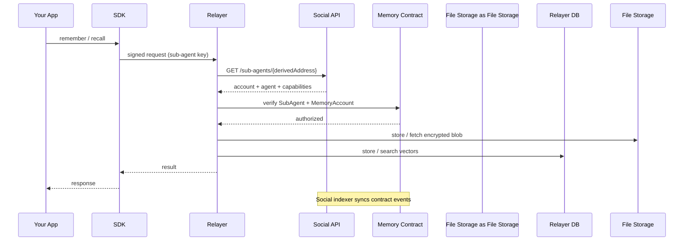

Memory is made up of five core components that work together to give your app encrypted, owner-controlled memory.



## SDK

The TypeScript SDK is the main entry point for developers. It wraps all Memory operations into a simple client that your app calls directly.

**Responsibilities:**
- Signs every request with a registered sub-agent key
- Sends requests to the relayer
- Exposes `remember`, `recall`, `analyze`, and `restore` methods
- On-chain helpers: `registerSubAgent`, `generateSubAgentKey`, etc.

```ts
const memory = Memory.create({
  key: process.env.MEMORY_PRIVATE_KEY!,
  accountId: process.env.MEMORY_ACCOUNT_ID!,
  serverUrl: process.env.MEMORY_SERVER_URL,
  namespace: "my-app",
});
```

## Relayer

The relayer is the backend service that processes all SDK requests. It abstracts Web3 complexity behind a REST API.

**Responsibilities:**
- Verifies Ed25519 signatures and resolves sub-agents (cache → social API → on-chain)
- Enforces capability bits (`CAP_MEMORY_READ` / `CAP_MEMORY_WRITE`) per route
- Generates embeddings, MYDATA encrypt/decrypt (via sidecar), File Storage upload/download
- Stores and searches vectors in PostgreSQL (pgvector)
- Scopes operations to `owner + namespace`

<Note>
Because the relayer handles encryption and plaintext data, you are placing trust in the relayer operator. You can [self-host](/relayer/self-hosting) or use the [manual client flow](/sdk/usage) for full client-side control.
</Note>

## Memory Smart Contract

The MySo smart contract (`social_contracts::memory`) is the source of truth for ownership and access control.

**Responsibilities:**
- Profile-linked MemoryAccounts (one per human owner)
- SubAgent registry keyed by `derived_address`
- Capability-gated MYDATA via `approve_key_policy(id, account, clock, ctx)`
- Emits lifecycle events indexed by the social stack

The contract does not store memory content — only identity and permissions.

## Social Indexer + API

The social indexer in **myso-core** indexes memory accounts and sub-agents. The memory relayer calls the social server API for fast lookup — there is no separate memory indexer in this repo.

**Relayer env:** `SOCIAL_SERVER_URL` (default `http://127.0.0.1:9126`)

## File Storage

Decentralized storage for encrypted memory payloads. Blob metadata includes `memory_namespace`, `memory_owner`, `memory_package_id`, and `memory_agent_id` (SubAgent object ID).

## Relayer Database

PostgreSQL + pgvector for the relayer only:

- `vector_entries` — embeddings linked to File Storage blob IDs
- `sub_agent_cache` — auth cache (public key → account, agent, capabilities)
- Rate limit / quota state (Redis + SQL)

If the database is lost, [restore](/sdk/usage/memory) can rebuild vectors from File Storage.
