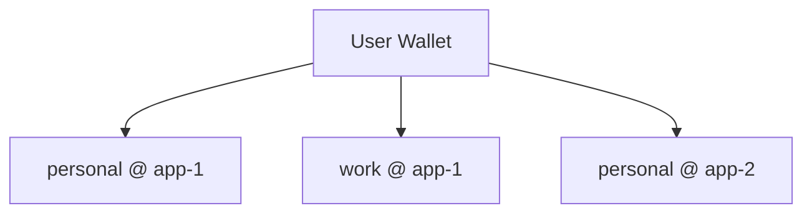

A **memory space** is the isolated unit of storage in Memory. Think of it as a folder or bucket for your memories — you choose which memory space to store into and which to retrieve from.

Each user can own as many memory spaces as they want.

## What defines a memory space?

Every memory space is uniquely identified by three values:

| Component | What it is |
|-----------|-----------|
| **Owner address** | The MySo wallet address that owns the memory |
| **Namespace** | A developer-defined label to group and organize memories |
| **App ID** | The Memory package ID (`MEMORY_PACKAGE_ID`) — unique per relayer deployment |

Together, `owner + namespace + app_id` form the boundary — no two memory spaces can overlap.

## Namespace

A namespace is simply a name you give to group related memories. One user can have multiple namespaces to separate different kinds of data.

For example:
- `personal` — store personal preferences, notes, and context
- `work` — store work-related knowledge and conversations
- `research` — store research findings and references

Namespaces are set in the SDK when you create a client:

```ts
const memory = Memory.create({
  key: process.env.MEMORY_PRIVATE_KEY!,
  accountId: process.env.MEMORY_ACCOUNT_ID!,
  serverUrl: process.env.MEMORY_SERVER_URL,
  namespace: "personal",
});
```

## App ID

The **app ID** is the Memory package ID deployed on MySo (`MEMORY_PACKAGE_ID`). Each relayer deployment is tied to a single package ID, which is used for MYDATA encryption key derivation and File Storage blob metadata.

Two separate Memory deployments can each have a user with a `personal` namespace, and their memories will never mix — because the app ID (package ID) is different. This means the vector database scopes queries by `owner + namespace`, while the encryption and blob discovery layer provides an additional isolation boundary through the package ID.

## How it works in practice



In this example, one user has three separate memory spaces:
- **personal** memories in **app-1**
- **work** memories in **app-1**
- **personal** memories in **app-2** (a completely different deployment)

Each is fully isolated — storing into one never affects the others, and recall only searches within the specified memory space.
