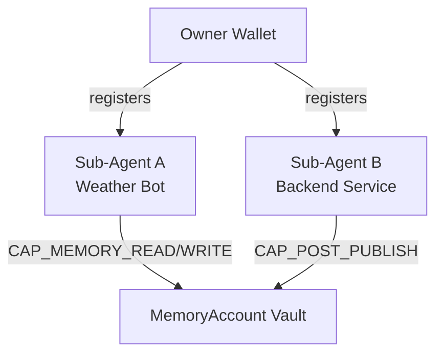

Memory enforces strong, cryptographic ownership over memories — and lets owners register **sub-agents** (Ed25519 keypairs with on-chain capability bitmaps) for scoped autonomous access.

## Ownership

Memory content is stored on File Storage and cryptographically owned by a user identified by their wallet. A **MemoryAccount** links a social profile to encrypted memory vaults. The human wallet that owns the MemoryAccount is the root authority.

```ts
const memory = Memory.create({
  key: subAgentPrivateKeyHex, // sub-agent key registered on-chain
  accountId: process.env.MEMORY_ACCOUNT_ID!, // MemoryAccount object ID
  serverUrl: process.env.MEMORY_SERVER_URL,
  subLabel: "personal",
});
```

Only the MemoryAccount owner (and their authorized sub-agents within granted capabilities) can access encrypted content or perform privileged actions. This is cryptographically enforced on-chain and verified by the relayer on every request.

## Sub-agents (replaces legacy delegates)

A **sub-agent** is an Ed25519 keypair registered as an on-chain `SubAgent` object with explicit capabilities (`CAP_MEMORY_READ`, `CAP_MEMORY_WRITE`, social caps, etc.). The sub-agent's `derived_address` signs relayer requests and MYDATA session keys.

This enables:

- **Autonomous agents** — AI or backend services act within capability bounds without holding the owner's wallet key
- **Hierarchy** — parent agents can register child agents via `registerSubAgentDelegated`
- **Scoped social actions** — post, comment, react, repost with `platform_scope` and expiry optional



## Access control enforcement

Sub-agent authorization is enforced on-chain by the MySo `memory` module — not by application policy alone.

- The owner's wallet registers and revokes sub-agents on the MemoryAccount
- The relayer resolves `derived_address → SubAgent`, checks capabilities, expiry, ancestry, and platform scope
- Social **deletes** additionally require the human owner to co-sign HTTP requests and sign the chain transaction

In v1, `approval_required_caps` and `max_action_spend` exist on-chain but are **not** enforced by the relayer. See [sub-agent-v1.md](../../contract/sub-agent-v1.md).

## Social delete pattern

On-chain post deletion is authorized by `post.owner` (the principal), not the sub-agent address. Clients must supply `ownerCoSignKey` for `deletePost` / `deleteComment` only — not for creates or reactions.
