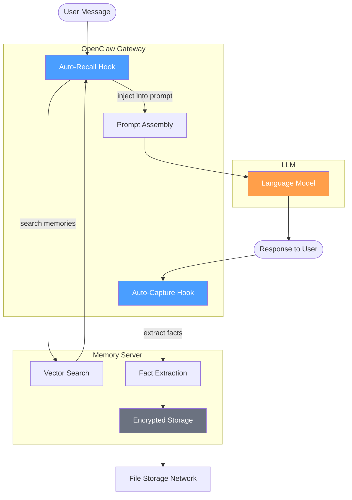

<h1 align="center">@socialproof/oc-memory</h1>

<p align="center">
  Cloud-based long-term memory plugin for NemoClaw/OpenClaw — gives your AI agents persistent, encrypted, cross-session memory powered by <strong>Memory</strong>.
</p>

<p align="center">
  <a href="https://docs.mysocial.network/openclaw/overview"><strong>Documentation</strong></a> ·
  <a href="#quick-start"><strong>Quick Start</strong></a> ·
  <a href="#verify"><strong>Verify</strong></a> ·
  <a href="#how-it-works"><strong>How It Works</strong></a>
</p>
<br/>

## Overview

Replaces OpenClaw's default file-based memory with a **remote memory backend**. After setup, the plugin runs silently — your agent remembers things from past conversations and learns new facts automatically, with no user intervention required.

Memories are **encrypted** and stored on **Memory**, a privacy-preserving memory protocol built on File Storage decentralized storage. Each user owns their memories via an **Ed25519 key** — no platform can access them without it.

**Features:**
- **Auto-recall** — relevant memories injected before each conversation turn
- **Auto-capture** — facts extracted and stored after each turn
- **Agent tools** — `memory_search` and `memory_store` for explicit LLM control
- **Multi-agent isolation** — each agent gets its own memory namespace
- **Prompt injection protection** — detection and escaping on all read/write paths
- **CLI** — `openclaw memory search` and `openclaw memory stats` for debugging

## Prerequisites

### OpenClaw

You need [OpenClaw](https://openclaw.ai) `>=2026.3.11` installed and running, and a package manager ([bun](https://bun.sh), pnpm, or npm).

### Memory Setup

**Memory** is an open-source, self-hostable memory infrastructure kit for encrypted, decentralized storage. You can run your own relayer or use a managed endpoint.

The plugin needs three values:

| Value | What it is |
|-------|-----------|
| **Delegate Key** | Private key (64-char hex) used to sign requests and encrypt memories |
| **Account ID** | Your MemoryAccount object ID on MySo (`0x...`) |
| **Relayer URL** | The Memory relayer endpoint that handles search, storage, and encryption |

Get your delegate key and account ID from the [Memory dashboard](https://mysocial.network), or see the [Quick Start guide](https://docs.mysocial.network/getting-started/quick-start) for detailed setup.

For the relayer, use a managed endpoint or [self-host your own](https://docs.mysocial.network/relayer/self-hosting):

| Environment | Relayer URL |
|-------------|-------------|
| **Production** (mainnet) | `https://memory.mysocial.network` |
| **Development** (testnet) | `https://relayer.testnet.mysocial.network` |

## Quick Start

### 1. Install

```bash
openclaw plugins install @socialproof/oc-memory
```

### 2. Set your delegate key

Store your delegate key as an environment variable so it's never hardcoded in config files:

```bash
# Add to your shell profile (.zshrc, .bashrc, etc.)
export MEMORY_PRIVATE_KEY="your-64-char-hex-key"
```

### 3. Configure OpenClaw

Add the plugin config to `~/.openclaw/openclaw.json`:

```jsonc
{
  "plugins": {
    "slots": { "memory": "oc-memory" },
    "entries": {
      "oc-memory": {
        "enabled": true,
        "config": {
          "privateKey": "${MEMORY_PRIVATE_KEY}",             // References the env var
          "accountId": "0x3247e3da...",                    // Your account ID from the dashboard
          "serverUrl": "https://relayer.testnet.mysocial.network"    // Or your self-hosted relayer
        }
      }
    }
  }
}
```

Optional settings you can add to the `config` block:

| Option | Default | Description |
|--------|---------|-------------|
| `autoRecall` | `true` | Inject relevant memories before each turn |
| `autoCapture` | `true` | Extract and store facts after each turn |
| `maxRecallResults` | `5` | Max memories to inject per turn |
| `minRelevance` | `0.3` | Relevance threshold (0-1) for memory injection |
| `captureMaxMessages` | `10` | How many recent messages to analyze for facts |

The defaults work well for most setups — you don't need to change them to get started.

### 4. Start OpenClaw

```bash
openclaw gateway stop && openclaw gateway
```

You should see in the logs:

```
memory: registered (server: https://..., key: e21d...ed9b, namespace: default)
memory: connected (status: ok, version: ...)
```

If you see `health check failed`, double-check that your server URL is reachable and your private key env var is set.

## Verify

### Check connectivity

Run the stats command to confirm the plugin is connected and configured correctly:

```bash
openclaw memory stats
```

This shows the server status, your key (masked), account ID, active namespace, and whether auto-recall/capture are enabled.

### Test the memory loop

The core value of the plugin is the automatic recall/capture cycle. Test it end-to-end:

1. **Store a fact** — start a conversation and share something memorable:

   ```
   You: I prefer TypeScript over JavaScript for backend work
   Bot: (responds normally)
   ```

   Check logs — you should see `memory: auto-captured 1 facts`. The plugin extracted the preference and stored it.

2. **Recall it** — in a **new conversation**, ask about it:

   ```
   You: What programming languages do I like?
   ```

   Check logs — you should see `memory: auto-recall injected 1 memories`. The plugin found the stored preference and injected it into the LLM's context.

3. **Search from terminal** — confirm the memory exists via CLI:

   ```bash
   openclaw memory search "programming"
   ```

If all three steps work, the plugin is fully operational.

---

## How it works

The plugin sits between OpenClaw's gateway and the Memory server. It operates through **hooks** — automatic callbacks that run on every conversation turn. The LLM never sees them, doesn't trigger them, and can't prevent them.



Every conversation turn goes through two phases:

- **Auto-recall** — before the LLM sees the user's message, the plugin searches Memory for relevant memories and injects them into the prompt as context. The LLM sees these as background knowledge — it doesn't know they were injected.

- **Auto-capture** — after the LLM responds, the plugin extracts the conversation, filters out trivial content (filler responses, emoji, etc.), and sends it to the Memory server. The server-side LLM extracts individual facts and stores them as encrypted blobs on File Storage.

The plugin also registers two optional **tools** (`memory_search` and `memory_store`) that give the LLM explicit control over memory operations. These require `tools.allow` in the agent profile and are a power-user feature — hooks handle the common case automatically.

## License

Apache-2.0
